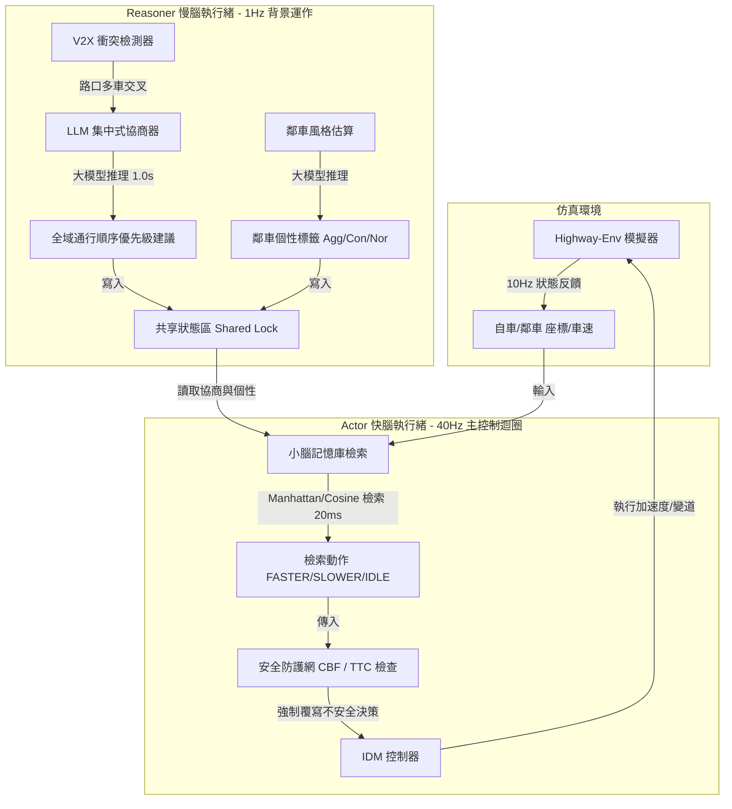

# CoDrivingLLM-Parallel-V2X (CP-V2X) 系統架構說明書

## 一、 項目願景與核心設計

**CoDrivingLLM-Parallel-V2X (簡稱 CP-V2X)** 是一個結合了 **CoDrivingLLM** 的「車路協同多車安全協商（V2X）」與 **Actor-Reasoner** 的「快慢腦雙系統（Parallel Threading）」優勢的下一代協同自動駕駛決策子專案。

### 1. 解決的痛點 (Problem Statement)
* **CoDrivingLLM 的缺點**：決策流程為單執行緒同步阻塞。車輛在路口做決定需要等待大模型推論（約 1.5 秒），**控制頻率過低（~1Hz）**，無法在真實世界中即時控制車輛。
* **Actor-Reasoner 的缺點**：多車衝突判定過於簡化。只挑選單一最危險的車輛進行一對一博弈，**缺乏真正的多車（Multi-Agent）V2X 協同排程與讓行共識機制**，且完全依賴資料庫檢索，缺乏硬性的物理安全防線。

### 2. 融合改進方案 (Core Solution)
CP-V2X 採用**雙執行緒異步並行架構**：
* **大腦 Reasoner (慢思考，~1Hz 背景執行緒)**：執行 CoDrivingLLM 的 V2X 多車衝突協商。大模型分析路網內所有 CAV 的幾何關係，排定順序，並識別鄰車的駕駛風格。
* **小腦 Actor (快反應，>40Hz 主控制執行緒)**：不呼叫大模型，直接依據慢腦最新產出的「多車協商共識」與「鄰車個性標籤」，在記憶庫中高速檢索車輛加速度動作。
* **安全防護網 (Low-Level Safety Shield)**：在 Actor 的檢索輸出與控制器之間，加上硬性的車距防護網（基於最小安全距離與 TTC），當檢索動作有幻覺時，強行介入煞車。

---

## 二、 系統架構圖與模組運作



### 模組詳細職責：

1. **V2X 衝突檢測與協商（Reasoner）**：
   * 收集交叉路口所有 CAV 的意圖與座標。
   * 通過 LLM 推導出一個全域的讓行序列（例如：`Ego passes 1st, CAV2 passes 2nd`）。
2. **駕駛個性評估（Reasoner）**：
   * 根據對手過去數個步長的動作，推斷其為激進或保守，更新至共享內存。
3. **二分雙層檢索器（Actor）**：
   * 依據共享內存中的個性標籤，切換到特定的記憶分區。
   * 將目前的「協商建議 + 數值座標」合併檢索，在 20ms 內產出控制動作。
4. **主動避護防線（Safety Shield）**：
   * 檢測前車車距與 TTC。若當前 TTC 小於 1.5 秒且 Actor 給予 `FASTER` 指令，防護網將強制修改指令為 `SLOWER`（最大強度減速）。

---

## 三、 子專案目錄結構規劃

```text
CoDrivingLLM_Parallel_V2X/
├── CoDrivingLLM_Parallel_V2X_Architecture.md  # 本說明書
├── Run_multi_CAV_Parallel.py                 # 主運行程式 (包含並行線程管理)
├── requirements.txt                          # 專案依賴
├── config.py                                 # 仿真與超參數配置
└── llm_controller/
    ├── __init__.py
    ├── memory_partition.py                   # 記憶庫分區管理與向量資料庫
    ├── parallel_agent.py                     # 快慢雙系統核心接口
    ├── prompt_templates.py                   # V2X協商與風格評估的Prompt定義
    ├── v2x_negotiator.py                     # 多車衝突協商演算法
    └── results/                              # 實驗結果存檔
        ├── excel/
        └── video/
```

---

## 四、 實驗評估指標 (Evaluation Metrics)

我們將使用以下交通工程與自動化領域的標準指標，來對比 **CP-V2X (本專案)**、**CoDrivingLLM** 與 **純 Actor-Reasoner** 的表現：

### 1. 安全性指標 (Safety Metrics)
* **碰撞率 (Collision Rate)**：在 100 回合中發生任何車輛碰撞的比例（目標: 趨近於 0%）。
* **最小後侵入時間 (Min PET)**：評估交叉路口通過時的極端安全裕度（目標: $> 1.5\text{s}$）。
* **極端危險車距比例 (TTC < 1.5s Rate)**：模擬中處於追撞危險區間的時間佔比，用以評估「安全防護網」的作用。

### 2. 交通效率指標 (Efficiency Metrics)
* **平均行駛車速 (Average Speed)**：受控車輛在成功回合中的平均速度，越高代表路口通行阻礙越小。
* **平均路口滯留時間 (Average Intersection Delay)**：車輛從接近路口到安全通過所花費的平均時間。

### 3. 即時控制指標 (Real-time Metrics)
* **控制更新頻率 (Control Loop Frequency)**：車輛馬達控制指令的每秒刷新次數（目標: $\ge 40\text{Hz}$）。
* **決策延遲 (Decision Latency)**：自車感知到環境狀態，到輸出動作的端到端時間開銷（目標: $< 25\text{ms}$）。
